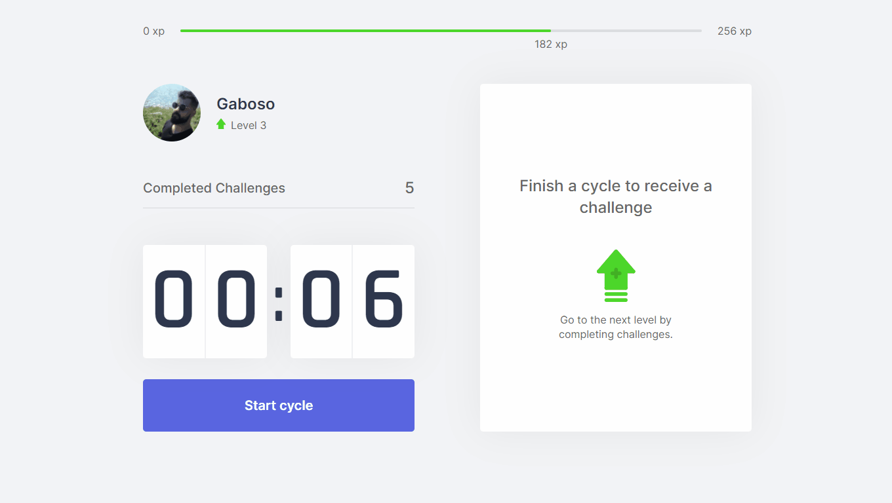

<p align="center">
   
</p>

_Move.it_ is a project developed during _Next Level Week 4 [#NLW4](https://github.com/topics/nlw-4)_, with the aim of bringing gamification and healthy productivity to people!



## Techs :earth_americas:

[](https://www.typescriptlang.org/)

[](https://reactjs.org/)

[](https://nextjs.org/)

## Layout :art:

 [](https://www.figma.com/file/DRlzlV6BnQXVmSlsH0M35c/Move.it-1.0?node-id=160%3A2761)

## Demo Website :globe_with_meridians:
https://move-it-blush.vercel.app/

## How to run :runner:

```bash
# install deps
yarn

# run server
yarn dev
```

> default address:  http://localhost:3000/

## Run lint :eye:

```bash
yarn lint
```

----

Made with :heart: by Gaboso - 2021
