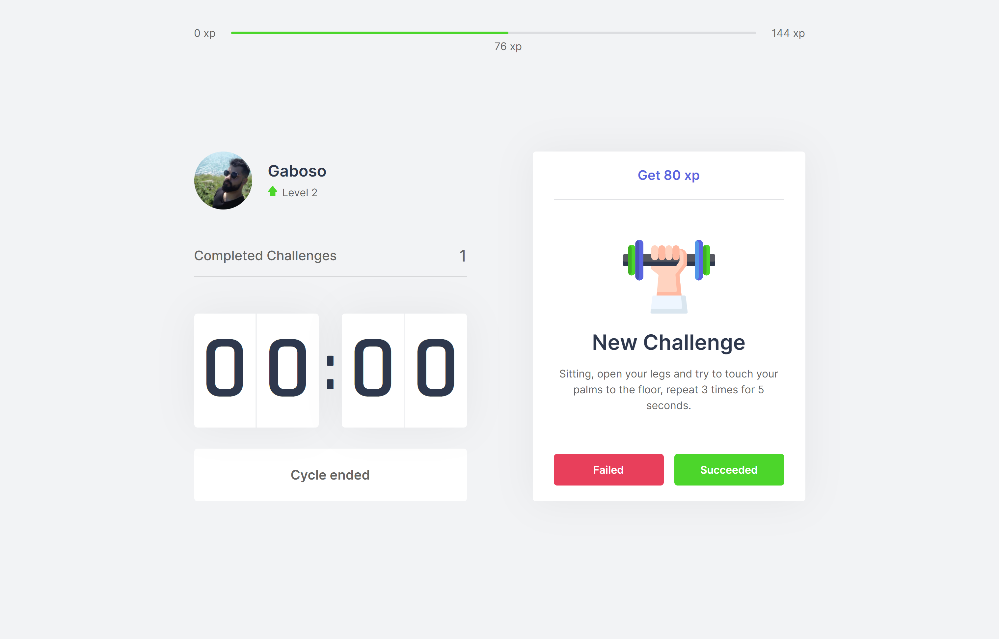

<p align="center">
   
</p>

# Move.it

Move.it is a project developed during Next Level Week 4 _[#NLW4](https://github.com/topics/nlw-4)_, with the aim of bringing gamification and healthy productivity to people!

<tr>
  <td>
     
  </td>
  <td>
    
  </td>
</tr>


#### Requirements :earth_americas:

| Requirements |
| :----------- |
| Node 12.x    | 
| Yarn         |

#### Install deps :gift:

```bash
yarn
```

#### Run lint :eye:

```bash
yarn lint
```

#### Start :cool:

```bash
yarn dev
```


----

Made with :heart: by Gaboso™ - 2021
